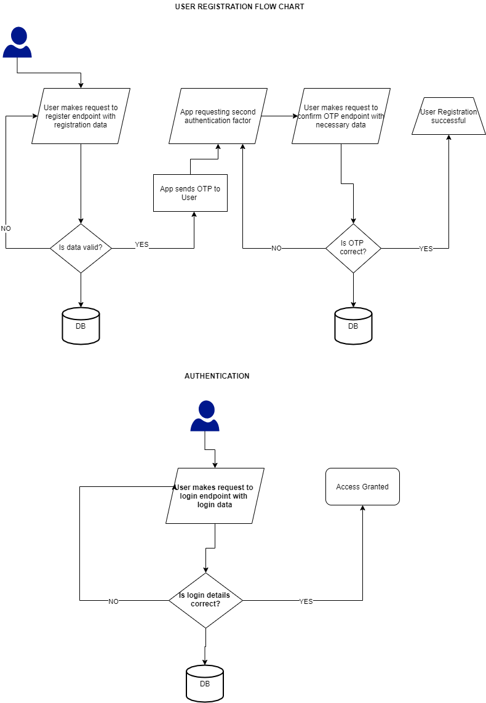

## Building Restful API with Django & DRF

## The Authentication System

### Overview

Authentication is the process of recognizing a user’s identity. It is the mechanism of associating an incoming request with a set of identifying credentials. The credentials provided are compared to those on a file in a database of the authorized user’s information on a local operating system or within an authentication server.

### For Context

We are to build a standalone full authentication API that can be used or injected into any application.

### Required Endpoints

1. Register
2. Generate OTP
3. OTP Verification endpoint.
4. Login
5. Logout
6. Forgot password
7. Reset password

### Expectations

- Your API design should fully conform with Restful API specification [read more](https://wiki.onap.org/display/DW/RESTful+API+Design+Specification)
- Both request and response payload should be in JSON format
- All API endpoints should have a consistent/uniform response format that provides a good user experience for API consumers
- OTP should be 4 or 6 numeric characters
- API should use bearer token (JWT or DRF token) for authorization
- API should be documented using postman or swagger or README Markdown with examples
- Github readme should be descriptive, detailed and clear and add a continuous integration badge(s)
- All API endpoints should be tested
- Set up a good continuous integration and deployment
- A good Git workflow should be used and code should be committed in chunks
- Ensure you download and read [Django for APIs](./assets/Django_for_APIs.pdf)
- [OPTIONAL] → Set up a GitHub project management tool for application and self-management

### Desired Authentication Flow

